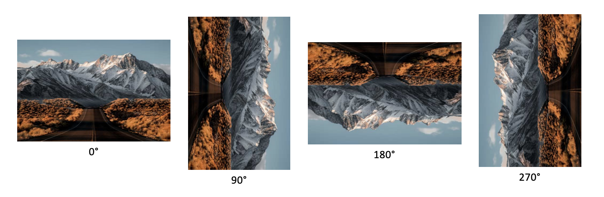

 

# Image Orientation Detection 
---------------------------------------------------------
:technologist: *by Lorenzo Mauri, Vasco Coelho*

:round_pushpin: *Data Science MSc, Università degli studi di Milano-Bicocca*

## Overview
* Task : predict the correct orientation of an image with respect to the coarse angles of 0, 90, 180,and 270 degrees.

> In this work we leverage the power of deep learning and adapt pre-trained Convolutional Neural Networks to the image canonical orientation detection task.
In order to address this problem we need a model that can exploit local and global discriminative information, both present in indoor and outdoor images or photos. 
Similar to human perception, Convolutional Neural Networks can take into account semantic cues to predict the correct orientation of the coarse angles 0, 90, 180,and 270 degrees.

 

## Dataset

* To be generated by the students

> One of the two main data sources considered is the large-scale benchmark dataset for scene recognition *SUN397*.  It contains 108754 images in 397 different categories with at least 100 images per category.
> The other main data source considered is the *MIT Indoor dataset* which contains  15620  images  in  67  different  categories  with  at  least  100  images  per category. 

## Requirements 

The .txt file [requirements](requirements.txt) lists the python packages used.

## Resources and how-to-run
During this work the code has been executed through a Google Colaboratory, therefore its usage is recommended in order to reproduce the project.

> Colaboratory, or “Colab” for short, is a product from Google Research. Colab allows anybody to write and execute arbitrary python code through the browser, and is especially well suited to machine learning, data analysis and education.  More technically, Colab is a hosted Jupyter notebook service that requires no setup to use, while providing free access to computing resources including GPUs. [more details](https://research.google.com/colaboratory/faq.html)

In the `notebook` folder of this repository, the following notebooks are provided : 

* `generator.ipynb` : this notebook contains the source code for the generation of the Indoor dataset. More specifically : 
     *  it downloads the `INDOOR_CVPR_09` images from the [ufficial website](http://groups.csail.mit.edu/vision/LabelMe/NewImages/)
     *  it rotates the `INDOOR_CVPR_09` images into four orientations and collocates them into their respective folders (0,90,180 and 270 degrees angles).
     * it backups all the data to Google Drive for future usage 
     
 As far as the SUN dataset is concerned, it has been handled locally due to memory limits imposed by Google Colaboratory.

* `vgg16.ipynb` : this notebook implements the VGG-16 model and contains the related source code. In particular : 
     * it migrates and loads both the Indoor and SUN datasets from Google Drive to the Colaboratory.
       
     * it merges the two dataset to get a unique one. Then it builds, tunes and saves the model. 

## Additional information
Further informations about context, methodology, results and interpretations are provided in this [report](Report.pdf) 

## Authors 

* Lorenzo Mauri

You can send me a message at lorenzo.mauri858@gmail.com or ping me on LinkedIn  

* Vasco Coehlo
